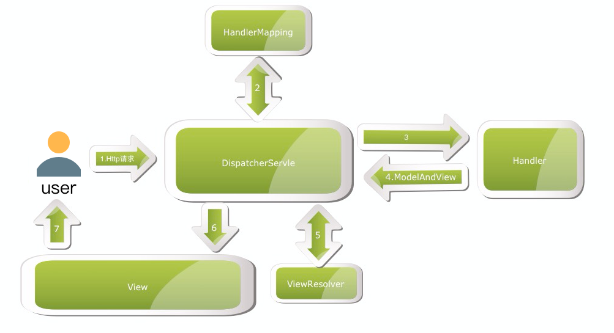

## 比较常用的 MVC 框架有 Struts 和 SpringMVC。

Struts 是 Java Web MVC 框架中曾经不争的王者。经过长达九年的发展，Struts 占有了 MVC 框架中最大的市场份额。但是 Struts 某些技术特性上已经落后于新兴的 MVC 框架。面对 Spring MVC、Webwork2 这些设计更精密，扩展性更强的框架，Struts 受到了前所未有的挑战。

Spring MVC 通过一套 MVC 注解，让 POJO 成为处理请求的控制器，无须实现任何接口，同时，Spring MVC 还支持 REST 风格的 URL 请求：注解驱动及 REST 风格的 Spring MVC 是 Spring 3.0 最出彩的功能之一。此外，Spring MVC 在数据绑定、视图解析、本地化处理及静态资源处理上都有许多不俗的表现。它在框架设计、扩展性、灵活性等方面全面超越了 Struts、WebWork 等 MVC 框架，从原来的追赶者一跃成为 MVC 的领跑者。

和众多其他 Web 框架一样，它基于 MVC 设计理念，此外，它采用了松散耦合可插拔组件结构，比其他 MVC 框架更具扩展性和灵活性。
Spring MVC 在数据绑定、视图解析、本地化处理及静态资源处理上都有许多不俗的表现。
Spring MVC 框架围绕 DispatcherServlet 这个核心展开，DispatcherServlet 是 Spring MVC 的总导演、总策划，它负责截获请求并将其分派给相应的处理器处理。

SpringMVC 的工作流程：

1.客户端发起 Http 请求，DispatcherServlet 接受客户端的请求 (相当于控制器);
2.DispatcherServlet 通过 HandlerMapping 寻找合适的处理器 (相当于 IOC);
3.DispatcherServlet 将请求发给Handler处理 (如有必要，Handler 还可以通过调用其它分布式服务实现目标);
4.Handler 将处理结果以 "ModelAndView" 的形式反馈给 DispatcherServlet;
5.DispatcherServlet 根据 ModelAndView 中 "View" 的指示，通过 ViewResolver 解析到合适的 View;
6.DispatcherServlet 将 ModelAndView 中的 "Model" 加载到上一步解析出来的 View 中(这个 View 可能是网页、xml、pdf 等等);
7.客户端获得 Http 响应。

流程示意图如下：

